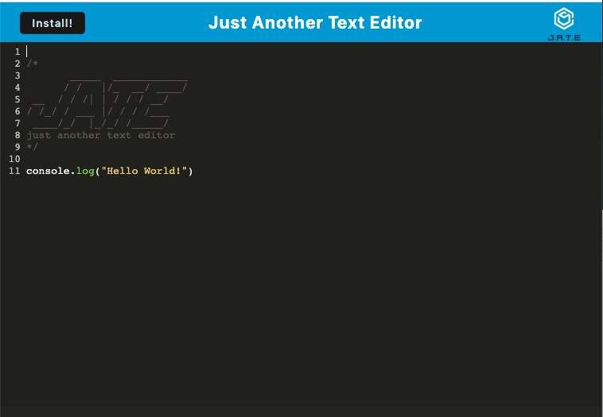

# text-editor
  [](https://opensource.org/licenses/MIT)

  ## Description
  Just Another Text Editor is an in browser text editor. By utilizing the user's local storage, IndexedDB, and service workers the application is able to operate, store, and retrive data even while offline. The application can also be downloaded to the users device.

  ## Table of Contents

  ♦︎[Installation](#installation)

  ♦︎[Usage](#usage)

  ♦︎[Questions](#questions)

  ## Installation

  To install the necessary dependencies, run the following command:

  ```
  npm i
  ```

  ## Usage

  To run the application locally, run the following command:
 ```
 npm run start
 ```
 Or access the applicaiton at it's deployed site https://young-coast-09075.herokuapp.com/



 Once running the application works as a simple text editor which will automatically save the user's progress if they click away from the screen.
 The applicaiton can also be downloaded from the browser by selecting the 'Install' button in the top left corner.
  

  ## License

  This project is licensed under the [MIT](https://opensource.org/licenses/MIT) license.


  ## Questions

  If you have any questions about the repo, open and issue or contact me directly at braddwagner@outlook.com. You can find more of my work on my [GitHub](https://github.com/braddwagner).

